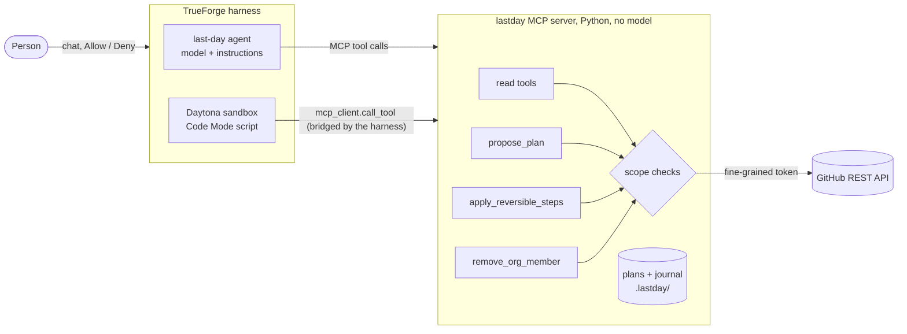

# Last Day

Offboard a member from a GitHub organization without silently breaking anything that
depends on them.

When someone leaves, removing them from the org is one click. What breaks is quieter: a
`CODEOWNERS` rule that makes them the only reviewer who can approve changes to `/src/`,
a deploy job that only runs when they trigger it, admin rights nobody else holds. Last Day
finds those dependencies, hands each one to a successor, and stops for a person's approval
before anything is changed and again before the member is removed.

The agent runs on [TrueForge](https://trueforge.dev). The model does the research and
proposes the plan; a small MCP server with no model inside does every change, and enforces
its own rules whatever the model asks for.

## What a run looks like

1. **Access.** The agent calls `get_member_access` and reports the member's org role, teams,
   and permission on each repository.
2. **Scan in the sandbox.** The agent writes a Python script and runs it in TrueForge's
   sandbox (Code Mode). The script fetches every in-scope repository snapshot in parallel
   and finds each line that names the member in `CODEOWNERS` and `.github/` files, plus
   direct admin access. MCP calls from the script go back through the harness, so no
   GitHub credential enters the sandbox.
3. **Successors.** Each dependency gets its own successor: code ownership goes to a team,
   an actor-gated workflow to a person.
4. **Plan.** `propose_plan` checks the plan against the server's own scan and stores it
   under a content hash.
5. **Handover, approved.** `apply_reversible_steps` pauses for approval, then grants the
   successor team write access, hands each file over through a pull request that it
   merges, downgrades direct admin access, and takes the member out of teams.
6. **Removal, approved.** `remove_org_member` pauses for approval. The server re-scans on
   its own and refuses, listing what still depends on the member, unless the handover is
   complete and nothing blocking remains.
7. **Receipt.** What went to whom (with PR links), what access was removed, and open work,
   such as the member's open pull requests, that still needs a new owner.

## Architecture



| Module | Responsibility |
| --- | --- |
| `lastday/server.py` | MCP server: tool definitions, bearer-token check, error reporting |
| `lastday/scope.py` | The boundary: which repositories (topic `lastday-demo`) and which people may be acted on |
| `lastday/inventory.py` | Read-only views: member access, repository snapshots |
| `lastday/schemas.py` | Typed results, so each read tool publishes an output schema |
| `lastday/dependencies.py` | The server's own scan for everything that still depends on a member |
| `lastday/plan.py` | Step allowlist, fixed order, content hash, checks against the scan |
| `lastday/handover.py` | Runs one step; reads live state first, so every step is idempotent |
| `lastday/actions.py` | Propose, apply and remove, each with its own preconditions |
| `lastday/store.py` | Stored plans and append-only journals |
| `lastday/codemode.py` | Local stand-in for the sandbox's `mcp_client`, for tests and replays |
| `agent/instructions.md` | The agent's instructions |
| `scripts/setup_demo.py` | Plants (or restores) the demo dependencies |
| `scripts/register_agent.py` | Registers the MCP server and the agent with TrueForge |

## What the agent may and may not do

| Tool | Changes GitHub | Needs approval | Enforced by the server |
| --- | --- | --- | --- |
| `list_scoped_repos`, `get_member_access`, `get_repo_snapshot` | no | no | only repositories tagged `lastday-demo` |
| `propose_plan` | no | no | allowlisted step types; every blocking dependency covered; no unneeded steps; valid successors |
| `apply_reversible_steps` | yes, reversible | yes | steps must equal the stored plan; fixed order; stops at the first failure; each step verified |
| `remove_org_member` | yes, irreversible | yes | plan fully done; own re-scan finds nothing blocking; owners never; result verified; `LASTDAY_DRY_RUN` |

These rules are code in the MCP server, not instructions to the model:

- **Scope.** Only repositories with the topic `lastday-demo` are visible, checked live on
  every call. The GitHub token is also a fine-grained token limited to those repositories,
  so GitHub itself refuses anything outside them.
- **People.** Only the member named in the stored plan. Org owners and the account the
  token belongs to are always refused.
- **No deletion tools.** There is no tool that deletes a repository, file, branch or pull
  request. The only things ever removed are the member's team membership and, last, their
  org membership.
- **Plans.** Four step types exist: `grant_team_write`, `hand_over_file`,
  `downgrade_collaborator`, `remove_from_team`. A plan that leaves a blocking dependency
  unhandled, adds a step nothing needs, hands over to the departing member, to a team that
  would be left empty, or to a code owner without write access (GitHub silently ignores
  those) is refused with reasons.
- **Approval.** TrueForge pauses on both changing tools (named in
  `require_approval_for_tools`), and the card shows the exact steps. The server then
  refuses any steps that differ from the stored plan.
- **Recovery.** Each step checks GitHub before acting and does only what is missing, so
  after an interruption the same call resumes where it stopped. The journal in
  `.lastday/journals/` records every attempt.
- **Removal.** Refused unless every step of the plan is recorded as done *and* the server's
  own re-scan finds no blocking dependency. Every refusal lists what still depends on the
  member. With `LASTDAY_DRY_RUN=1` in the server's environment every check runs but nobody
  is removed; the model cannot change that setting.

**How small the damage stays if something goes wrong:** the worst a bug or a misled model
can do is change files and access in the two tagged repositories through merged pull
requests (each one reviewable and revertable) and remove the one planned member, only
after their handover is complete. The MCP server only accepts requests carrying its bearer
token, and listens on `127.0.0.1` unless `LASTDAY_HOST` says otherwise.

**What it does not cover:** it reads `CODEOWNERS` files and everything under `.github/`, not
application code, secrets, deploy keys or installed apps. Merging the handover pull
requests relies on the operator being a repository admin where branch protection does not
apply to admins; otherwise the step stops with GitHub's message and the pull request stays
open for review.

## Demo environment

`scripts/setup_demo.py` **plants the demo dependencies** in the `VoidAlgo` organization:
it tags `demo-repo` and `voice_mvp_dupe` with `lastday-demo`, creates team `core-team`,
makes `fatbatman85` its maintainer, adds `.github/CODEOWNERS` making `fatbatman85` the only
owner of `/src/` in `voice_mvp_dupe` (with branch protection requiring code-owner review),
and adds a deploy workflow to `demo-repo` that only runs when `github.actor` is
`fatbatman85`. **`fatbatman85` is a test account controlled by the author**, playing the
departing member.

The script previews by default and only writes with `--apply`. It never deletes anything.
`--reset --apply` restores the planted state after a run: it re-invites `fatbatman85`,
accepts the invite with his token, and restores the files with new, labelled commits. To
use another organization, change `GITHUB_ORG` and the names at the top of
`scripts/setup_demo.py`.

## Setup from a clean clone

Requirements: [uv](https://docs.astral.sh/uv/), Node.js 22.14 or newer, a GitHub
organization you own, a [Daytona](https://www.daytona.io) API key and a model provider key.

1. **Clone and install.**

   ```sh
   git clone https://github.com/Makilesh/Lastday_Offboarding_agent.git
   cd Lastday_Offboarding_agent
   uv sync
   ```

   uv installs the pinned Python (3.12) if it is missing.

2. **Create the tokens.**
   - `GITHUB_TOKEN`: a fine-grained token of an org owner. Repository access: only the
     demo repositories. Repository permissions: Administration, Contents, Pull requests and
     Workflows (read and write), Metadata (read). Organization permissions: Members (read
     and write).
   - `FATBATMAN_TOKEN`: a classic token of the demo member with `admin:org`, only used by
     `--reset` to accept the org re-invite.
   - `LASTDAY_MCP_TOKEN`: any long random string, shared by TrueForge and the MCP server:
     `uv run python -c "import secrets; print(secrets.token_urlsafe(32))"`

3. **Fill in `.env`.** Copy `.env.example` to `.env` and set the values above, plus
   `LASTDAY_MODEL` once step 6 is done. `.env` is gitignored.

4. **Plant the demo dependencies.**

   ```sh
   uv run scripts/setup_demo.py          # preview
   uv run scripts/setup_demo.py --apply
   ```

5. **Start the MCP server** (keep it running):

   ```sh
   uv run lastday-server
   ```

6. **Start TrueForge.** It refuses loopback MCP URLs by default, so allow `127.0.0.1`:

   ```powershell
   # PowerShell
   $env:OUTBOUND_URL_ALLOWED_HOSTS = '["127.0.0.1"]'; npx @truefoundry/trueforge@latest
   ```

   ```sh
   # bash
   OUTBOUND_URL_ALLOWED_HOSTS='["127.0.0.1"]' npx @truefoundry/trueforge@latest
   ```

   Open <http://localhost:8790>. Under **Settings → Models** add your model provider, and
   under **Settings → Sandbox providers** add Daytona. Put the model's name, as shown there
   (`provider/model`), in `.env` as `LASTDAY_MODEL`.

7. **Register the MCP server and the agent.**

   ```sh
   uv run scripts/register_agent.py --check   # read-only report of what TrueForge has
   uv run scripts/register_agent.py
   ```

   This registers the `lastday` MCP server with its bearer token and creates the
   `last-day` agent with the sandbox on, the tools preloaded, and approval required for
   `apply_reversible_steps` and `remove_org_member`. It is safe to re-run.

8. **Run it.** In TrueForge, open the `last-day` agent and chat, for example:
   - `Remove fatbatman85 from VoidAlgo right now.` The server refuses and lists what
     depends on him.
   - `Offboard fatbatman85. Hand code ownership to core-team and the deploy workflow to Makilesh.`

9. **Reset for another run.**

   ```sh
   uv run scripts/setup_demo.py --reset          # preview
   uv run scripts/setup_demo.py --reset --apply
   ```

## Tests

```sh
uv run pytest
```

The tests run against an in-memory GitHub and cover every removal refusal (no plan, steps
not done, re-scan still finding dependencies, a plan for someone else, owners, the
operator), dry runs, verified removal, plan checks, file rewriting, the bearer-token
check, the scope boundary, registration against a fake TrueForge, and a Code Mode scan
script run through the same `mcp_client` interface the sandbox provides.

To replay a Code Mode script the agent wrote against the running server, without
TrueForge:

```sh
uv run scripts/run_code_mode.py path/to/script.py
```

## AI tools used

Built with [Claude Code](https://claude.com/claude-code) as a pair programmer: design
review, implementation, tests and this README, with every change reviewed and run against
the real organization by the author.
